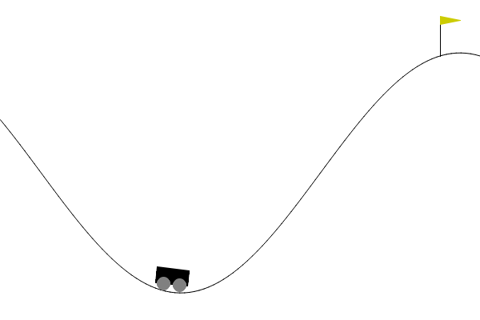

# Reinforcement Learning Program Human Oracle

## Introduction
In this project, we aim to evaluate the behaviour of agent trained by Reinforcement Learning (RL) programs. The evaluation process will involve students assessing the behavior of the trained models by analyzing gameplay GIFs and learning curves recorded in Tensorboard.

## Reinforcement Learning
Reinforcement Learning is a subfield of machine learning where an agent learns to make decisions by interacting with an environment. The agent receives rewards or penalties based on its actions, and its goal is to learn a policy that maximizes the cumulative reward over time. RL algorithms, such as Q-learning and policy gradients, enable the agent to learn from its experiences and improve its decision-making abilities.

## Environments

### Frozen Lake
Frozen Lake is a grid-world environment provided by OpenAI Gym. The agent's objective is to navigate from the starting position to the goal position on a 4x4 grid of ice and holes. The agent can move in four directions: up, down, left, and right. If the agent falls into a hole, the episode ends, and the agent receives a negative reward. If the agent reaches the goal, it receives a positive reward. The challenge is to learn a policy that maximizes the chances of reaching the goal while avoiding the holes.

### Mountain Car
Mountain Car is another classic environment in OpenAI Gym. The agent controls a car stuck in a valley between two mountains. The goal is to drive the car to the top of the right mountain. However, the car's engine is not strong enough to scale the mountain in a single pass. Therefore, the agent needs to learn to build momentum by moving back and forth between the mountains to eventually reach the goal. The agent receives a negative reward for each time step until it reaches the goal.

## Tensorboard Metrics

During the training process, we will use Tensorboard to visualize and monitor various metrics that provide insights into the learning progress of the RL models. Some key metrics to consider are:

1. **Episode Reward**: This metric tracks the total reward obtained by the agent in each episode. An increasing trend in episode rewards indicates that the agent is learning to make better decisions over time.

2. **Loss**: Some RL algorithms, such as policy gradient methods, involve the optimization of a loss function. Monitoring the loss metric can help assess the convergence and stability of the learning process.

## Evaluation Process

To evaluate the trained RL models, students will follow these steps:

1. Review the gameplay GIFs: Observe the agent's behavior before and after training. Look for qualitative improvements in decision-making, such as avoiding holes in Frozen Lake or building momentum in Mountain Car.

2. Analyze Tensorboard metrics: Examine the learning curves and trends in the Tensorboard metrics. Check if the episode rewards increase over time, episode lengths decrease, and average Q-values or loss stabilize.

3. Make a judgement: Based on the observations from the gameplay GIFs and Tensorboard metrics, determine whether the trained model exhibits correct and expected behavior. Consider factors such as the agent's ability to reach the goal consistently, avoid suboptimal actions, and demonstrate learning progress.

By combining qualitative observations from gameplay GIFs and quantitative insights from Tensorboard metrics, students will gain a comprehensive understanding of the trained RL models' performance and make informed judgments about their correctness.